<div align="center">




<br/>


&nbsp;
<a href="https://github.com/niteboy17?tab=followers"></a>

</div>

---

### 👨‍💻 About Me

```javascript
const tausif = {
  pronouns:    "he/him",
  location:    "🇧🇩 Bangladesh",
  currentWork: "Building Thinkboard — a MERN stack notes app",
  learning:    ["TypeScript", "Docker", "System Design"],
  askMeAbout:  ["React", "Node.js", "MongoDB", "REST APIs"],
  funFact:     "I debug with console.log and I'm not ashamed 😄",
};
```

---

### 🛠️ Tech Stack

<div align="center">

**Frontend**


**Backend**


**Tools & Platforms**


</div>

---

### 🚀 Featured Project

<div align="center">

[](https://github.com/niteboy17/thinkboard)

**Thinkboard** — A full-stack notes web app built with the MERN stack.  
Features markdown support, user auth, and a clean responsive UI.  
Deployed on **Render** · Built with **MongoDB · Express · React · Node.js**

</div>

---

### 📊 GitHub Stats

<div align="center">
  
  &nbsp;&nbsp;
  
</div>

<div align="center">
  
</div>

---

### 🏆 GitHub Trophies

<div align="center">
  
</div>

---

### 📈 Contribution Graph

<div align="center">
  
</div>

---

<div align="center">

*"First, solve the problem. Then, write the code."* — John Johnson

</div>
