<div align="center">

<picture>
  <source media="(prefers-color-scheme: dark)" srcset="dark.svg">
  <source media="(prefers-color-scheme: light)" srcset="light.svg">
  
</picture>

<br/><br/>


<br/>


<br/><br/>

<a href="https://your-portfolio-url.dev"></a>
<a href="https://linkedin.com/in/your-linkedin"></a>
<a href="mailto:your-email@gmail.com"></a>
<a href="https://github.com/niteboy17"></a>

<br/><br/>


</div>

<br/>

---

## 🧠 About Me

<div align="left">

I'm a **Full Stack Software Engineer** specializing in the **MERN stack** (MongoDB, Express, React, Node.js) and cross-platform mobile development with **React Native / Expo**. I build production-grade web and mobile applications end-to-end — from real-time backend systems to polished, accessible frontend interfaces.

- 🏗️ Focused on **scalable architecture**, clean API design, and maintainable codebases
- ⚡ Experienced with real-time systems (**Socket.IO**), state management (**Zustand**), and modern styling (**Tailwind CSS, DaisyUI**)
- 📱 Comfortable shipping across the stack — **web, backend, and mobile**
- 🎯 Product-engineering mindset: I care about how a feature *feels* to use, not just whether it works

**🔭 Open To:** Full-time Software Engineering roles · Freelance/Contract work · Open Source collaboration

</div>

---

## 🛠️ Tech Stack

**Languages**
<br/>


**Frontend**
<br/>


**Backend & Databases**
<br/>


**Cloud, DevOps & Tooling**
<br/>


---

## 🤖 AI / ML Expertise

> _Fill in based on your actual experience — table below is a placeholder structure only._

| Domain | Proficiency | Details |
|---|---|---|
| Add domain | ⭐⭐⭐☆☆ | Add specifics |
| Add domain | ⭐⭐⭐☆☆ | Add specifics |

---

## 🚀 Featured Projects

<details>
<summary><b>💬 Mew-Chat — Real-Time MERN Chat Application</b></summary>
<br/>

Real-time messaging app with typing indicators, online presence, and media sharing, built on the MERN stack with Socket.IO for live communication.

| | |
|---|---|
| **Stack** | React, Node.js, Express, MongoDB, Socket.IO, Zustand, Cloudinary, DaisyUI |
| **Scale** | _Add metric (e.g. concurrent users, messages/day)_ |
| **Performance** | _Add metric (e.g. latency, load time)_ |
| **Security** | _Add detail (e.g. JWT auth, input validation)_ |
| **Impact** | _Add detail_ |
| **Repository** | [github.com/niteboy17/mew-chat](https://github.com/niteboy17) |

</details>

<details>
<summary><b>💰 Wallet App — Full-Stack Mobile Expense Tracker</b></summary>
<br/>

Cross-platform expense tracking app built with React Native/Expo and a dedicated Express backend, with authentication and rate-limited APIs.

| | |
|---|---|
| **Stack** | React Native, Expo, Express, PostgreSQL (Neon), Clerk (Auth), Redis (rate limiting) |
| **Scale** | _Add metric_ |
| **Performance** | _Add metric_ |
| **Security** | Clerk-managed authentication, Redis-backed API rate limiting |
| **Impact** | _Add detail_ |
| **Repository** | [github.com/niteboy17](https://github.com/niteboy17) |

</details>

<details>
<summary><b>📝 Thinkboard — MERN Notes App</b></summary>
<br/>

Full-stack notes application deployed on Render, covering CRUD operations with a clean React frontend.

| | |
|---|---|
| **Stack** | React, Node.js, Express, MongoDB |
| **Scale** | _Add metric_ |
| **Performance** | _Add metric_ |
| **Security** | _Add detail_ |
| **Impact** | Deployed and live on Render |
| **Repository** | [github.com/niteboy17](https://github.com/niteboy17) |

</details>

<details>
<summary><b>🐦 Twitter Clone</b></summary>
<br/>

Full-stack clone replicating core Twitter functionality — feed, posts, and interactions.

| | |
|---|---|
| **Stack** | MERN Stack |
| **Scale** | _Add metric_ |
| **Performance** | _Add metric_ |
| **Security** | _Add detail_ |
| **Impact** | _Add detail_ |
| **Repository** | [github.com/niteboy17](https://github.com/niteboy17) |

</details>

<details>
<summary><b>▶️ Silvey-YouTube — YouTube Frontend Clone</b></summary>
<br/>

Frontend clone recreating the YouTube browsing experience and UI patterns.

| | |
|---|---|
| **Stack** | React, TypeScript, Tailwind CSS |
| **Scale** | _Add metric_ |
| **Performance** | _Add metric_ |
| **Security** | N/A (frontend-only) |
| **Impact** | _Add detail_ |
| **Repository** | [github.com/niteboy17/silvey-youtube](https://github.com/niteboy17) |

</details>

<details>
<summary><b>✅ TypeScript TODO App</b></summary>
<br/>

Task management app built to reinforce type-safe frontend development patterns.

| | |
|---|---|
| **Stack** | TypeScript, React |
| **Scale** | _Add metric_ |
| **Performance** | _Add metric_ |
| **Security** | _Add detail_ |
| **Impact** | _Add detail_ |
| **Repository** | [github.com/niteboy17](https://github.com/niteboy17) |

</details>

<details>
<summary><b>📚 Java Library Management System</b></summary>
<br/>

Desktop-style library management system covering book inventory, member records, and lending logic.

| | |
|---|---|
| **Stack** | Java, OOP principles |
| **Scale** | _Add metric_ |
| **Performance** | _Add metric_ |
| **Security** | _Add detail_ |
| **Impact** | _Add detail_ |
| **Repository** | [github.com/niteboy17](https://github.com/niteboy17) |

</details>

---

## 💼 Experience

> _No roles are listed yet — add real positions below. Placeholder structure shown._

**Job Title · Company Name**
<br/>
_Month Year – Month Year_

Professional description of the role and its scope.

- Scope of work bullet point
- Scope of work bullet point
- Scope of work bullet point

`Skill` `Skill` `Skill` `Skill`

---

## 🏆 Achievements

<div align="center">

| Recognition | Details |
|---|---|
| _Add achievement_ | _Add details_ |
| _Add achievement_ | _Add details_ |

</div>

---

## 📜 Certifications

**AWS**
<br/>


**Oracle**
<br/>


**NPTEL**
<br/>


**Cisco**
<br/>


---

## 💻 Coding Profiles

<div align="center">

<a href="https://leetcode.com/your-handle"></a>
<a href="https://geeksforgeeks.org/user/your-handle"></a>
<a href="https://hackerrank.com/your-handle"></a>
<a href="https://codechef.com/users/your-handle"></a>

</div>

---

## 📊 GitHub Analytics

<div align="center">


<br/>


</div>

---

## 🏅 GitHub Trophies

<div align="center">


</div>

---

## 📈 Contribution Activity

<div align="center">


</div>

---

## 🐍 Contribution Snake

<div align="center">


<sub>Requires the snake-generation GitHub Action set up on your profile repo to populate this asset.</sub>

</div>

---

## 🎯 Current Focus

```yaml
Learning:
  - Advanced system design & scalable architecture
  - TypeScript best practices at scale
Building:
  - Real-time full-stack applications (MERN + Socket.IO)
  - Cross-platform mobile apps with React Native / Expo
Exploring:
  - Cloud deployment & DevOps workflows
Open To:
  - Full-time Software Engineering roles
  - Freelance / contract collaborations
  - Open source contributions
```

---

## 📬 Connect

<div align="center">

<a href="mailto:your-email@gmail.com"></a>
<a href="https://linkedin.com/in/your-linkedin"></a>
<a href="https://github.com/niteboy17"></a>
<a href="https://your-portfolio-url.dev"></a>

</div>

---

<div align="center">

_"Code is the closest thing we have to magic — write it with intention."_


</div>
